I work on decentralized AI infrastructure, subnet analytics, validators, miners, monitoring tools and Linux-based automation.

## Focus

- Bittensor validators and miners
- Subnet monitoring, scoring and analytics
- Python backend tools and FastAPI dashboards
- Linux / Ubuntu server automation
- Cloud and bare-metal infrastructure
- GRE/network tunneling, traffic generators and long-running processes
- Technical security research and public-data analysis

## Current work

- Building lightweight tools for subnet tracking and validator/miner monitoring
- Researching scoring behavior, emissions and leaderboard dynamics
- Improving dashboards, Telegram alerts and operational visibility

## Stack

`Python` · `FastAPI` · `Linux` · `Ubuntu` · `Bash` · `Docker` · `PM2`  
`Terraform` · `PostgreSQL` · `Grafana`  
`Bittensor` · `Subtensor` · `Validators` · `Miners` · `Monitoring`

## Infrastructure mindset

- Keep systems observable
- Prefer simple services over fragile complexity
- Automate repeated operations
- Measure before optimizing
- Treat public data as a research surface

## Hosting

Workloads run across several providers — GPU compute, always-on bare metal and small
utility nodes have different requirements, and spreading them out means no single
provider outage takes everything down.

- **[Linode](https://www.linode.com/lp/refer/?r=fffc386247e18142bd23cdb0fea1f2a5bc50b3bf)** — long-running services, dashboards and monitoring bots.
- **[Hetzner](https://www.hetzner.com/)** — dedicated servers and VPS for 24/7 miner and validator processes; best price-to-performance in the fleet.
- **[Vultr](https://www.vultr.com/?ref=9918845)** — on-demand instances when a node is needed in a specific region, fast.
- **[Verda](https://verda.com/)** (formerly DataCrunch) — Nordic GPU cloud for H100/H200 inference and model workloads.
- **[OVHcloud](https://www.ovhcloud.com/)** — bare metal and DDoS-protected endpoints.

Need a box to run any of this? The Linode and Vultr links above are referral links —
new Linode accounts get starter credit.

## Contact

- GitHub: [@NodesNodes](https://github.com/NodesNodes)
